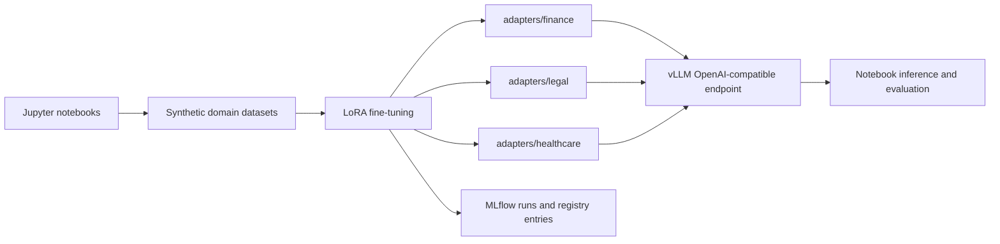

# Notebook-first LLMOps Demo

This repository demonstrates a notebook-driven workflow for creating, tracking, deploying, and testing standalone PEFT LoRA adapters for `Qwen/Qwen2.5-7B-Instruct`.

The current project no longer uses a Docker deployment or a FastAPI gateway. The core workflow is implemented through Jupyter notebooks, with small Python modules under `training/`, `evaluation/`, `scripts/`, and `llmops_demo/` providing reusable helper code for the notebook cells.

## What It Builds



The default adapter set is:

- `finance`
- `legal`
- `healthcare`

The adapters remain standalone PEFT LoRA artifacts. They are not merged into the base model.

## Repository Layout

- `notebooks/`: the main end-to-end workflow.
- `training_data/`: generated JSON chat datasets for each domain.
- `adapters/`: trained adapter output directories.
- `training/generate_synthetic.py`: deterministic synthetic dataset generation.
- `training/train_lora.py`: PEFT LoRA training and MLflow logging.
- `training/register_mlflow.py`: registration of existing local adapters in MLflow.
- `evaluation/evaluate.py`: lightweight adapter response evaluation.
- `scripts/load_adapters.py`: calls the vLLM LoRA runtime loading endpoint.
- `scripts/test_inference.py`: OpenAI-compatible smoke test against vLLM.
- `llmops_demo/settings.py`: environment-backed project configuration.

## Setup

Use Python 3.11.

Linux/macOS:

```bash
python -m venv .venv
source .venv/bin/activate
pip install --upgrade pip
pip install -r requirements.txt
cp .env.example .env
```

Windows PowerShell:

```powershell
python -m venv .venv
.\.venv\Scripts\Activate.ps1
pip install --upgrade pip
pip install -r requirements.txt
Copy-Item .env.example .env
```

Start JupyterLab from the notebook directory so the existing notebook path setup resolves project files correctly:

```bash
cd notebooks
python -m jupyterlab
```

Then open the printed JupyterLab URL in your browser.

## Notebook Workflow

Run the notebooks in order:

1. `01_generate_datasets.ipynb`
2. `02_train_finance_lora.ipynb`
3. `03_train_legal_lora.ipynb`
4. `04_train_healthcare_lora.ipynb`
5. `05_mlflow_tracking.ipynb`
6. `06_start_vllm.ipynb`
7. `07_load_adapters.ipynb`
8. `08_test_inference.ipynb`

### 1. Generate Datasets

`01_generate_datasets.ipynb` creates deterministic synthetic chat datasets for each domain using templates in `training/generate_synthetic.py`.

Outputs:

- `training_data/finance.json`
- `training_data/legal.json`
- `training_data/healthcare.json`

Each record contains OpenAI-style `messages` with a system prompt, user instruction, and assistant response.

### 2. Train LoRA Adapters

`02_train_finance_lora.ipynb`, `03_train_legal_lora.ipynb`, and `04_train_healthcare_lora.ipynb` each call `training.train_lora.train_adapter(...)`.

Training loads the base model, applies a PEFT LoRA configuration, formats the JSON chat records through the tokenizer chat template, and saves one adapter directory per domain.

Outputs:

- `adapters/finance/`
- `adapters/legal/`
- `adapters/healthcare/`

Training also logs parameters, tags, and adapter artifacts to MLflow.

### 3. Track and Register in MLflow

`05_mlflow_tracking.ipynb` configures MLflow, registers any local adapters that already exist, and displays recent experiment runs.

By default, MLflow is file-backed and does not require a service:

```text
MLFLOW_TRACKING_URI=file:./mlruns
```

Registered model names use this pattern:

```text
qwen2_5_7b_lora_<adapter>
```

For example:

- `qwen2_5_7b_lora_finance`
- `qwen2_5_7b_lora_legal`
- `qwen2_5_7b_lora_healthcare`

The MLflow model wrapper points to the standalone adapter artifact. It does not package a merged model.

### 4. Start vLLM

`06_start_vllm.ipynb` documents the vLLM serving configuration used for LoRA runtime loading.

For MLIS or another vLLM deployment, configure vLLM with:

```text
VLLM_ALLOW_RUNTIME_LORA_UPDATING=True
```

and start it with LoRA support, for example:

```text
--served-model-name base --enable-lora --max-model-len 4096
```

The notebook then checks the OpenAI-compatible model endpoint:

```text
GET /v1/models
```

### 5. Load Adapters into vLLM

`07_load_adapters.ipynb` downloads adapter artifacts from MLflow, places them where the vLLM server can read them, and loads each adapter through:

```text
POST /v1/load_lora_adapter
```

The helper implementation is in `scripts/load_adapters.py`.

The loaded model names match the adapter names:

- `finance`
- `legal`
- `healthcare`

### 6. Test Inference

`08_test_inference.ipynb` uses the OpenAI Python client against the vLLM OpenAI-compatible API:

```python
from openai import OpenAI

client = OpenAI(
    base_url=f"{settings_cfg.vllm_base_url}/v1",
    api_key=settings_cfg.vllm_api_key,
)
```

It sends prompts to the adapter model names and runs a lightweight keyword-based evaluation through `evaluation/evaluate.py`.

## Configuration

Most settings are read from `.env` through `llmops_demo/settings.py`.

Common settings:

```text
BASE_MODEL=Qwen/Qwen2.5-7B-Instruct
DATA_DIR=training_data
ADAPTER_DIR=adapters
OUTPUT_DIR=outputs
ADAPTERS=finance,legal,healthcare

MLFLOW_TRACKING_URI=file:./mlruns
MLFLOW_EXPERIMENT_NAME=llmops-lora-demo
MLFLOW_REGISTERED_MODEL_PREFIX=qwen2_5_7b_lora

TRAIN_EPOCHS=1
TRAIN_BATCH_SIZE=1
GRADIENT_ACCUMULATION_STEPS=4
LEARNING_RATE=0.0002
MAX_SEQ_LENGTH=1024
LORA_R=16
LORA_ALPHA=32
LORA_DROPOUT=0.05

VLLM_BASE_URL=http://localhost:8000
VLLM_API_KEY=local-dev
```

Update `VLLM_BASE_URL` and `VLLM_API_KEY` when targeting an MLIS or remote vLLM endpoint.

## Optional Script Entry Points

The notebooks are the primary interface, but the same backend code can be called directly:

```bash
python training/generate_synthetic.py
python training/train_lora.py --adapter finance
python training/register_mlflow.py
python scripts/load_adapters.py --base-url http://localhost:8000
python scripts/test_inference.py --adapter finance
python evaluation/evaluate.py
```

These scripts are useful for smoke tests and automation, but the expected demo flow is to run the notebooks.

## Hardware Notes

Training and vLLM serving are intended for a CUDA-capable environment.

Recommended baseline:

- 16 GB VRAM minimum for small LoRA experiments.
- 24 GB or more VRAM for smoother local serving.
- Linux or WSL2 for vLLM and `bitsandbytes`.

On Windows, `bitsandbytes` and `vllm` are excluded by environment markers in `requirements.txt`, so training or serving may need to run on Linux, WSL2, MLIS, or another GPU host.

## Expected End State

After completing the notebook workflow, you should have:

- Three JSON training datasets under `training_data/`.
- Three PEFT LoRA adapter directories under `adapters/`.
- MLflow runs and registered adapter model entries.
- A vLLM endpoint serving `base`, `finance`, `legal`, and `healthcare` model names.
- Successful notebook inference calls against the loaded adapters.
