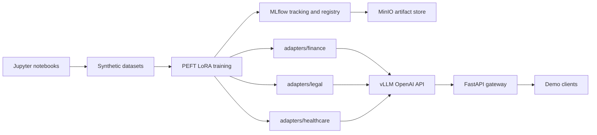

# Notebook-first LLMOps Demo

This repository is a local-first LLMOps demo for training standalone PEFT LoRA adapters in JupyterLab, tracking them in MLflow, serving them with vLLM, and routing requests through FastAPI. The same adapter artifacts and loading scripts can later be copied to an HPE MLIS + vLLM server.

## Architecture



Base model: `Qwen/Qwen2.5-7B-Instruct`

Adapters:

- `finance`
- `legal`
- `healthcare`

The adapters stay as standalone PEFT LoRA adapters. They are not merged into the base model.

## Local Setup

Use Python 3.11.

```bash
python -m venv .venv
source .venv/bin/activate
pip install --upgrade pip
pip install -r requirements.txt
cp .env.example .env
```

Windows PowerShell:

```powershell
python -m venv .venv
.\.venv\Scripts\Activate.ps1
pip install --upgrade pip
pip install -r requirements.txt
Copy-Item .env.example .env
```

Start local MLflow and MinIO:

```bash
make up
```

Start JupyterLab:

```bash
make notebooks
```

Open `http://localhost:8888` and use the token from `.env` or `JUPYTER_TOKEN`.

## Notebook Workflow

Run notebooks in order:

1. `notebooks/01_generate_datasets.ipynb`
2. `notebooks/02_train_finance_lora.ipynb`
3. `notebooks/03_train_legal_lora.ipynb`
4. `notebooks/04_train_healthcare_lora.ipynb`
5. `notebooks/05_mlflow_tracking.ipynb`
6. `notebooks/06_start_vllm.ipynb`
7. `notebooks/07_load_adapters.ipynb`
8. `notebooks/08_fastapi_gateway.ipynb`
9. `notebooks/09_test_inference.ipynb`
10. `notebooks/10_end_to_end_demo.ipynb`

Each notebook includes markdown explanations, runnable cells, architecture diagrams, example prompts, and expected outputs.

## MLflow and MinIO

`docker-compose.yml` provides:

- MLflow UI on `http://localhost:5000`
- MinIO API on `http://localhost:9000`
- MinIO console on `http://localhost:9001`

Default local credentials are configured in `.env.example`:

```text
AWS_ACCESS_KEY_ID=minioadmin
AWS_SECRET_ACCESS_KEY=minioadmin
MLFLOW_ARTIFACT_BUCKET=mlflow
```

For the simplest notebook-only path, the default tracking URI is file-backed:

```text
MLFLOW_TRACKING_URI=file:./mlruns
```

To use the MLflow service instead, set:

```text
MLFLOW_TRACKING_URI=http://localhost:5000
```

The training notebooks and scripts log adapter metadata, training parameters, adapter artifacts, and registered model entries named like `qwen2_5_7b_lora_finance`.

## Serving

Start vLLM locally:

```bash
make serve
```

The vLLM service runs with:

```text
--enable-lora
VLLM_ALLOW_RUNTIME_LORA_UPDATING=True
```

Load adapters dynamically:

```bash
python scripts/load_adapters.py
```

The loader calls the OpenAI-compatible vLLM server's LoRA management endpoint:

```text
POST /v1/load_lora_adapter
```

Start the FastAPI gateway:

```bash
make api
```

The gateway exposes:

- `GET /health`
- `POST /chat`
- `POST /v1/chat/completions`

Example routed request:

```bash
curl -X POST http://localhost:8080/chat \
  -H "Content-Type: application/json" \
  -d '{"messages":[{"role":"user","content":"Explain revenue concentration risk."}]}'
```

Expected behavior: the gateway routes finance prompts to the `finance` adapter, legal prompts to `legal`, healthcare prompts to `healthcare`, and unknown prompts to `base`.

## GPU Notes

Practical local training and vLLM serving require a CUDA GPU.

Recommended baseline:

- 16 GB VRAM minimum for small quantized LoRA experiments
- 24 GB or more VRAM for smoother local serving
- Linux or WSL2 for vLLM and `bitsandbytes`
- NVIDIA Container Toolkit for Docker GPU access

## MLIS Migration

After local training:

1. Verify these directories exist:
   - `adapters/finance/`
   - `adapters/legal/`
   - `adapters/healthcare/`
2. Copy `adapters/`, `.env`, `scripts/load_adapters.py`, and the serving configuration to the MLIS environment.
3. Set MLIS environment variables:
   - `BASE_MODEL` to the MLIS-visible base model path or model id
   - `ADAPTER_DIR` to the mounted adapter directory
   - `VLLM_BASE_URL` to the remote vLLM endpoint
   - `VLLM_API_KEY` if required
4. Start remote vLLM with `--enable-lora` and `VLLM_ALLOW_RUNTIME_LORA_UPDATING=True`.
5. Run `python scripts/load_adapters.py`.
6. Point the FastAPI gateway or demo client at the remote vLLM endpoint.

No model merge step is required. The LoRA adapters remain portable PEFT artifacts.

## Make Targets

- `make up`: start MLflow and MinIO
- `make notebooks`: start JupyterLab
- `make serve`: start vLLM with LoRA enabled
- `make datasets`: generate datasets through the script backend
- `make train`: train all adapters through the script backend
- `make register`: register local adapters in MLflow
- `make load-adapters`: load adapters into vLLM
- `make api`: start FastAPI gateway
- `make test`: run inference smoke tests and evaluation

