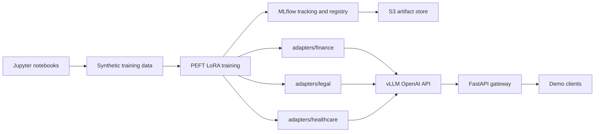

# Notebook-first LLMOps Demo

This repository is a local-first LLMOps demo for training standalone PEFT LoRA adapters in JupyterLab, tracking them in MLflow, serving them with vLLM, and routing requests through FastAPI. The same adapter artifacts and loading scripts can later be copied to an HPE MLIS + vLLM server.

## Architecture



Base model: `Qwen/Qwen2.5-7B-Instruct`

Adapters:

- `finance`
- `legal`
- `healthcare`

The adapters stay as standalone PEFT LoRA adapters. They are not merged into the base model.

## Notebook Workflow

Run notebooks in order:

1. `notebooks/01_generate_datasets.ipynb`
2. `notebooks/02_train_finance_lora.ipynb`
3. `notebooks/03_train_legal_lora.ipynb`
4. `notebooks/04_train_healthcare_lora.ipynb`
5. `notebooks/05_mlflow_tracking.ipynb`
6. `notebooks/06_start_vllm.ipynb`
7. `notebooks/07_load_adapters.ipynb`
8. `notebooks/08_fastapi_gateway.ipynb`
9. `notebooks/09_test_inference.ipynb`
10. `notebooks/10_end_to_end_demo.ipynb`

Each notebook includes markdown explanations, runnable cells, architecture diagrams, example prompts, and expected outputs.

Training data is stored in `training_data/` instead of `datasets/` so local files do not shadow Hugging Face's `datasets` package. The training code keeps the Hugging Face import unchanged:

```python
from datasets import load_dataset
```

## GPU Notes

Practical local training and vLLM serving require a CUDA GPU.

Recommended baseline:
- 16 GB VRAM minimum for small quantized LoRA experiments
- 24 GB or more VRAM for smoother local serving
